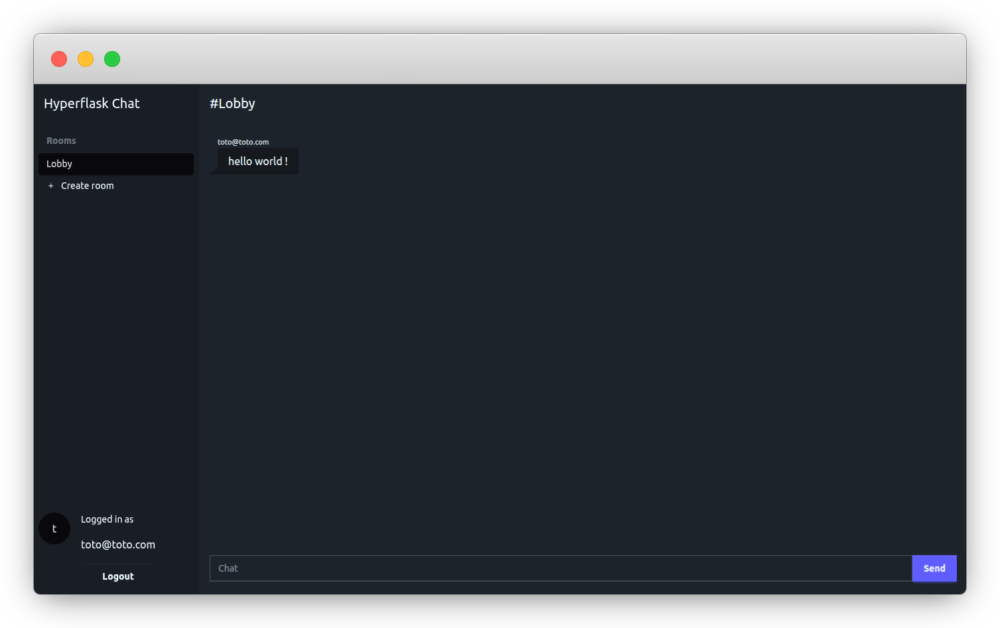

# Hyperflask Getting Started App

This is the repository for the [Hyperflask Getting Started guide](https://hyperflask.dev/getting-started/)

## How to run

Without dev containers:

1. Install at least Python 3.10 and [uv](https://docs.astral.sh/uv/)
2. Run `uv run hyperflask dev`

Using VS Code and with the dev containers extension:

1. Open your project folder in vscode
2. Use the *Dev Containers: Reopen in Container* command from the Command Palette
3. Launch your app using F5

Using dev containers standalone:

1. [Install devcontainers-cli](https://github.com/devcontainers/cli#npm-install)
2. Start dev container: `devcontainer up --workspace-folder .`
3. Launch your app: `devcontainer exec uv run hyperflask dev`
3. Go to http://localhost:5000
